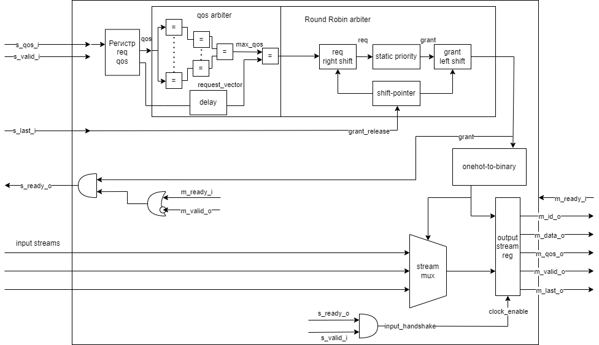

# QOS-Arbiter

## Содержание

- [QOS-Arbiter](#qos-arbiter)
  - [Содержание](#содержание)
  - [Структура репозитория](#структура-репозитория)
  - [Структурная схема блока](#структурная-схема-блока)
  - [Описание работы устройства](#описание-работы-устройства)
    - [Параметры модуля](#параметры-модуля)
  - [Описание работы тестового окружения](#описание-работы-тестового-окружения)
  - [Архитектурные решения и возможные оптимизации](#архитектурные-решения-и-возможные-оптимизации)
      - [QoS-арбитр, реализованный с помощью дерева компараторов](#qos-арбитр-реализованный-с-помощью-дерева-компараторов)
      - [Буферизация](#буферизация)
  - [Оценка итогового дизайна](#оценка-итогового-дизайна)
    - [Оценка затраченных аппаратных ресурсов](#оценка-затраченных-аппаратных-ресурсов)
    - [Оценка тактовой частоты](#оценка-тактовой-частоты)

## Структура репозитория

В репозитории содержится несколько разделов:

1) Директория `img` содержит структурную схему устройства
2) Директория `rtl` содержит файлы исходного кода модуля
3) Директория `tb` содержит тестовое окружение для симуляции работы устройства.

## Структурная схема блока

## Описание работы устройства

Разработанный модуль представляет собой арбитр, реализующий алгоритм Round-Robin для нескольких входящих каналов с сигналом Quality of Service(QoS). Данный модуль позволяет отдавать приоритет каналу с наибольшим значением параметра QoS. В случае, если таких каналов несколько, то для арбитража используется алгоритм Round-Robin. Кроме того, случай QoS = 0 считается равным максимальному из имеющихся приоритетов, поэтому канал с таким значением приоритета обрабатывается с помощью Round Robin арбитража совместно с остальными.

Арбитраж реализован с помощью двух основных блоков: QoS-арбитр, вычисляющий маску приоритетных запросов, а также RR-арбитр, реализующий арбитраж нескольких каналов. QoS-арбитр реализован с помощью дерева компараторов, которые вычисляет наибольшее значение QoS из активных на данный момент каналов, а также отдельного компаратора составляющего маску из запросов с наибольшим приоритетом. Данный битовый вектор передается на вход RR-арбитру, который выдает итоговый приоритет одному из запрашивающих каналов.

Отдельной частью модуля является контроллер выходного интерфейса в качестве master-устройства. Все выходы модуля, за исключением сигнала `s_ready_o` выходят из регистров для увеличения возможной тактовой частоты. Выходные данные выбирают с помощью мультиплексора, управляемым с помощью сигнала, указывающего на выбранный арбитром канал.

Выходной интерфейс модуля позволяет передавать данные и QoS выбранного канала. Сигнал `m_last_o` разграничивает передаваемые транзакции, а сигнал `m_id_o` указывает на номер выбранного входного канала.

### Параметры модуля

| Название параметра | Стандартное значение | Описание |
| -------- | ------- | -------|
| T_DATA_WIDTH | 8 | Разрядность шины данных |
| T_QOS__WIDTH | 4 | Разрядность параметра QoS канала|
| STREAM_COUNT | 2 | Количество входных потоков|

## Описание работы тестового окружения

Для проверки работы модуля было разработано тестовое окружение, реализующее входное воздействие: были реализованы сценарии воздействия двух каналов:
1)  С разными значениями QoS
2)  С одинаковыми значениями QoS
3)  Один из каналов имеет QoS = 0

Тестовое окружение использовалось для ручной проверки по средством временной диаграммы работы устройства.

## Архитектурные решения и возможные оптимизации

В разработанном модуле приняты следующие архитектурные решения:

#### QoS-арбитр, реализованный с помощью дерева компараторов

Подобное решение позволяет уменьшить критический путь в сравнении последовательным сравнением каждого элемента. Кроме того, разработанный модуль является универсальным и полностью конфигурируемым, таким образом дерево компараторов возможно применять при любой конфигурации устройства, а не только для случаев $2^N$ входов. Каждый из компараторов имеет регистр на выходе для сокращения критического пути, что, однако, определяет задержку модуля. Одна из возможных оптимизаций - полное удаление регистров из дерева компараторов, либо частичное удаление при образовании критического пути на данном модуле.

Как уже было сказано ранее, прежде всего дерево компараторов определяет задержку в тактах между появлением запроса на входе и появлении потока на выходе, а именно $log_2(N)$ тактов. Однако если запрос на входе модуля всего один он все равно должен пройти через дерево сравнений. Таким образом, для оптимизации быстродействия возможно добавить байпас request -> grant в случае, если запрос всего один.

#### Буферизация

Выходные сигналы master-интерфейса модуля подаются с регистров, таким образом для их перезаписи требуется отдельный такт, так как регистр, хранящий выходные данные является общим и входные данные выбираются с помощью сигнала приоритета.

## Оценка итогового дизайна

Для синтеза и имплементации был использован САПР Vivado 2024.1. Синтез проводился для стандартного набора параметров. Использованная плата xc7a100tcsg324-1. В качестве тактовой частоты используется 100 МГц.

### Оценка затраченных аппаратных ресурсов

Согласно отчету по утилизации сгенерированному Vivado на реализацию данного модуля затрачено 65 LUT и 94 триггера. Все LUT используются для синтеза логики, а не ячеек памяти, что является оптимальным для такого небольшого модуля. Затрачено порядка 0.05% от общего числа LUT. Затраченные регистры составляют порядка 0.03% от общего числа Slice регистров, т.е уже существующих, а не синтезируемых с помощью LUT.

Для сравнения также был проведен синтез и имплементация варианта c 4 каналами. Утилизация составила 72 LUT и 96 триггеров, что составляет 0.11 и 0.08 % от общего их числа соответственно.

### Оценка тактовой частоты
Согласно временному отчету Worst Negative Slack составил 4.18 нс. По определению - это разница между периодом тактового сигнала и суммой времени прохождения сигнала от выхода одного триггера до входа следующего, а также времени установки триггера. Исходя из этого можно рассчитать рабочую частоту для текущего варианта дизайна:

$$f = \frac{1}{10 - 4.18} = 171.8 МГц.$$ 

При этом, критический путь лежит от выхода дерева компараторов до формирования сигнала `s_ready_o`, который используется для сброса регистров, хранящих значение QoS для всех каналов.